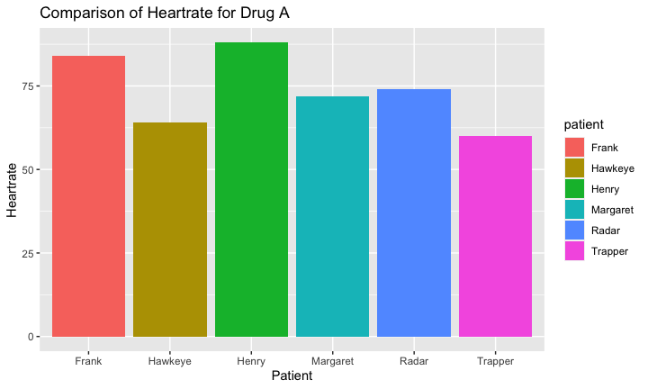
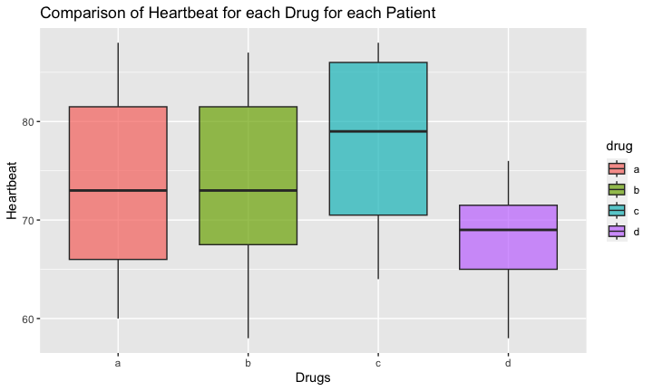

## Seating & Set-up
1. Please make sure that you sit next to your group members for the rest of the quarter.

2. Please set-up your computer as normal.

## Warm-up
For this warm-up, please use the `heartrate` data. Be sure to label your plots!

1. Make a plot that compares the heartrate of patients for drug a.

```
## ── Attaching packages ─────────────────────────────────────── tidyverse 1.3.2 ──
## ✔ ggplot2 3.4.0      ✔ purrr   1.0.0 
## ✔ tibble  3.1.8      ✔ dplyr   1.0.10
## ✔ tidyr   1.2.1      ✔ stringr 1.5.0 
## ✔ readr   2.1.3      ✔ forcats 0.5.2 
## ── Conflicts ────────────────────────────────────────── tidyverse_conflicts() ──
## ✖ dplyr::filter() masks stats::filter()
## ✖ dplyr::lag()    masks stats::lag()
## 
## Attaching package: 'janitor'
## 
## 
## The following objects are masked from 'package:stats':
## 
##     chisq.test, fisher.test
## 
## 
## here() starts at /Users/rsjariwa/Desktop/BIS15W2023_RJariwala-main/lab11
```

```
## Rows: 6 Columns: 5
## ── Column specification ────────────────────────────────────────────────────────
## Delimiter: ","
## chr (1): patient
## dbl (4): a, b, c, d
## 
## ℹ Use `spec()` to retrieve the full column specification for this data.
## ℹ Specify the column types or set `show_col_types = FALSE` to quiet this message.
```

```
## [1] "patient" "a"       "b"       "c"       "d"
```

For drug a:
<!-- -->

2. Make a plot that compares heartrate (as a range) for each drug.
<!-- -->
